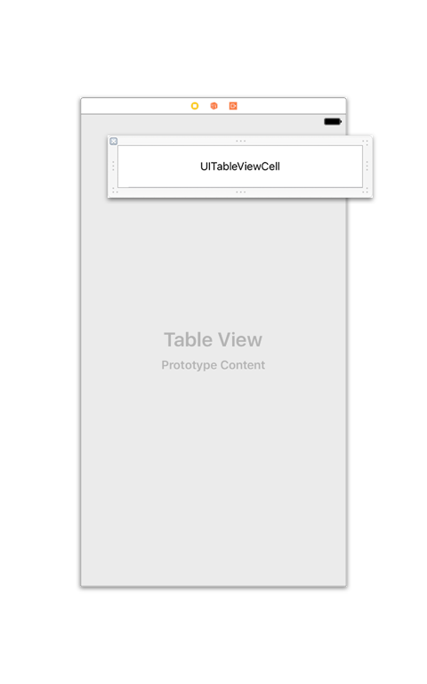
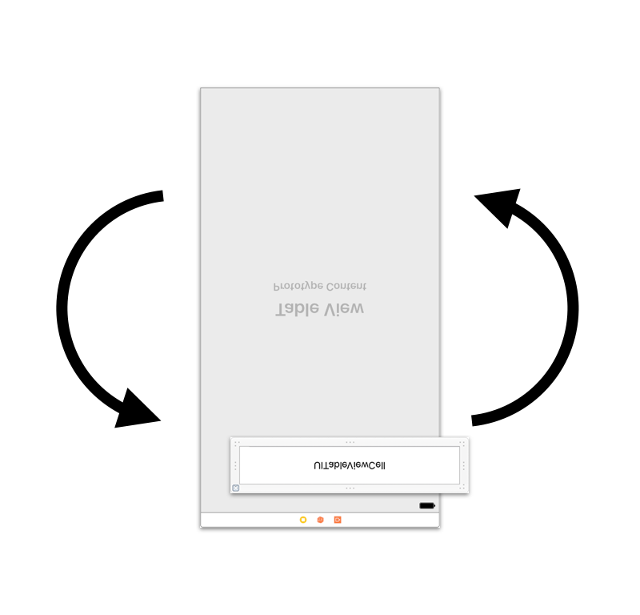
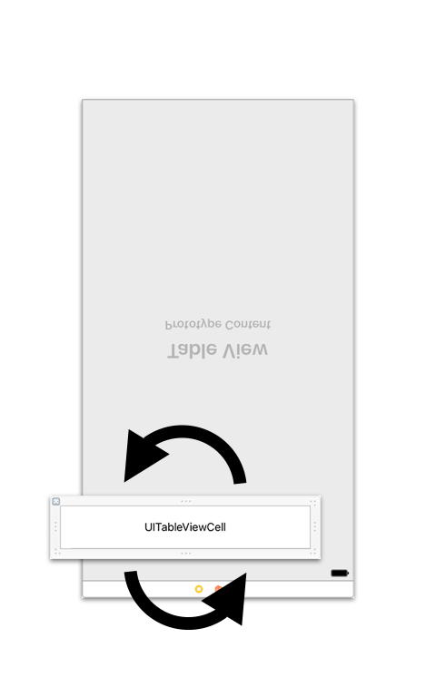
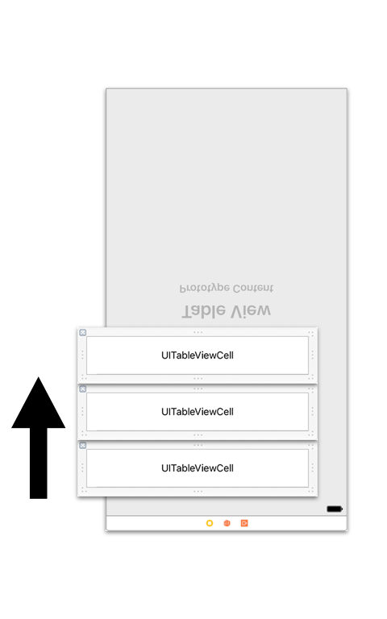

# ReverseExtension

[](http://cocoapods.org/pods/ReverseExtension)
[](https://developer.apple.com/swift)
[](http://cocoapods.org/pods/ReverseExtension)
[](http://cocoapods.org/pods/ReverseExtension)
[](https://github.com/Carthage/Carthage)

A `UITableView` extension that enables cell insertion from the bottom of a table view.


## Concept

It is difficult to fill a tableview content from the bottom.

ReverseExtension rotates the `UITableView` and the `UITableViewCell`s like in these images.






If you implement this logic in `UIViewController`, it will add too much complexity.

By encapsulating the implementation to the `re` namespace property, we hide the complexity.

In addition, you can roll back to the normal behavior by removing the `re` namespace.

## Example

```swift
import UIKit
import ReverseExtension

class ViewController: UIViewController {
    @IBOutlet weak var tableView: UITableView!

    override func viewDidLoad() {
        super.viewDidLoad()
        tableView.dataSource = self
        tableView.register(UITableViewCell.self, forCellReuseIdentifier: "Cell")

        //You can apply reverse effect just by setting the delegate.
        tableView.re.delegate = self
        tableView.re.scrollViewDidReachTop = { scrollView in
            print("scrollViewDidReachTop")
        }
        tableView.re.scrollViewDidReachBottom = { scrollView in
            print("scrollViewDidReachBottom")
        }
    }
}

extension ViewController: UITableViewDelegate {
    //ReverseExtension also supports handling UITableViewDelegate.
    func scrollViewDidScroll(_ scrollView: UIScrollView) {
        print("scrollView.contentOffset.y =", scrollView.contentOffset.y)
    }
}
```

## Requirements

- Swift 3.0
- Xcode 8.0 or greater
- iOS 8.0 or greater

## Installation

#### CocoaPods

ReverseExtension is available through [CocoaPods](http://cocoapods.org). To install
it, simply add the following line to your Podfile:

```ruby
pod "ReverseExtension"
```

#### Carthage

If you’re using [Carthage](https://github.com/Carthage/Carthage), simply add
ReverseExtension to your `Cartfile`:

```
github "marty-suzuki/ReverseExtension"
```

Make sure to add `ReverseExtension.framework` to "Linked Frameworks and Libraries" and "copy-frameworks" Build Phases.

## Special Thanks

[TouchVisualizer](https://github.com/morizotter/TouchVisualizer) (Created by [@morizotter](https://github.com/morizotter))

## Author

marty-suzuki, s1180183@gmail.com

## License

ReverseExtension is available under the MIT license. See the LICENSE file for more info.
